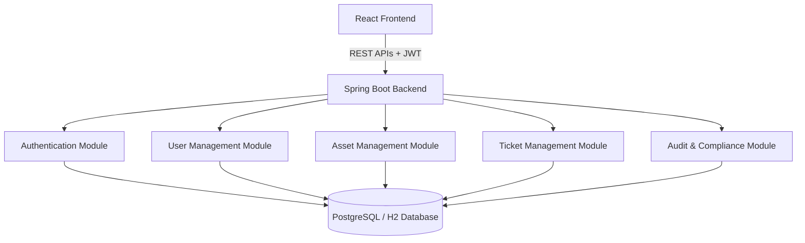

# NCL HQ ITSM Platform

Welcome to the **NCL HQ IT Service Management (ITSM) Platform**, an enterprise-grade service desk, ticketing, and asset management ecosystem custom-designed for the Northern Coalfields Limited (NCL) Headquarters.

This repository is structured as a monorepo containing a multi-module Spring Boot Java backend and a Vite-based React frontend.

---

## 📂 Project Architecture



### 📦 Repository Directories
* **[java backend](file:///d:/GIANDEEP%20MAIN/NCL_ITSM_SOFTWARE_WEBSITE/java%20backend)**: Multi-module Maven project implementing REST APIs, Spring Security (JWT), Active Directory/LDAP baselines, ticket workflows, POI Excel reconciliation, and audit log compliance.
* **[react frontend](file:///d:/GIANDEEP%20MAIN/NCL_ITSM_SOFTWARE_WEBSITE/react%20frontend/ncl-itsm-frontend)**: Modern React 19 + TypeScript dashboard styled with Vanilla CSS and Tailwind, with state managed via Zustand and server routing using Axios.

---

## 🛠 Features & Module Breakdown

### 1. Authentication & Security Portal
* **Universal Secure Login:** Both administrators and standard employees log in using the same universal form.
* **JWT Stateless Sessions:** The backend signs a cryptographic JSON Web Token that the frontend React app stores to authenticate sub-requests.
* **Email One-Time Password (OTP):** Generates and sends a 6-digit OTP to the employee's registered corporate email during login and password resets.
* **Testing Console Helper:** Displays a toggleable QA console at the bottom of the login card for sandbox testing, featuring an *Autofill* button for default admin access.

### 2. Administrative User Control
* **Restricted Registrations:** Only users with `IT Administrator` or `Super Admin` roles can access the user registration page.
* **Designation Locking:** Designation is set strictly by the Admin during registration. The employee's self-profile editing page disables this field (`🔒 Locked`).
* **Complete Modification Console:** Admins can edit names, emails, phone numbers, designations, departments, roles, active/locked status, or set new passwords for any user from the centralized user management list.

### 3. Asset Registry & Excel Reconciliation Wizard
* **Physical Hardware Registry:** Track corporate inventories (Desktops, Laptops, Printers, IP Phones) and allocation states (`Assigned`, `Available`, `Maintenance`).
* **Software Registry & Expirations:** Dynamic visual progress bars tracking license allocations, automatic safety warnings, and Recharts graphs illustrating expiry timelines.
* **Consumables Stock Tracker:** Real-time stock counts (Safety reserves) with triggers warning when stock falls below safety levels.
* **Bulk Reconciliation Wizard (Excel Import):** A 3-step import wizard designed to upload large spreadsheets, map Excel columns to the active database catalog, resolve quantity conflicts, and bulk-sync inventory.

### 4. Ticket Service Queue
* **Dynamic Help Desk:** Create tickets categorized by urgency (`Low`, `Medium`, `High`, `Critical`).
* **Lifecycle Routing:** Support engineers can claim requests, track statuses (`Pending`, `In Discussion`, `Resolved`), and measure SLA compliance.
* **Intake Charting:** Integrates Recharts graph charts displaying ticket counts over the past 7 days.

---

## 🚀 How to Run the Ecosystem

### Prerequisites
* **Java Development Kit (JDK 21)** or higher.
* **Node.js (v18+)** and **npm** package manager.

---

### Step 1: Launch the Backend Server

1. Open your terminal.
2. Navigate to the backend directory:
   ```powershell
   cd "d:\GIANDEEP MAIN\NCL_ITSM_SOFTWARE_WEBSITE\java backend"
   ```
3. Run the boot module using the Maven wrapper:
   ```powershell
   .\.maven\apache-maven-3.9.6\bin\mvn.cmd spring-boot:run -pl ncl-itsm-config
   ```

> [!TIP]
> To enable automatic compilation and hot reloading as you save files, open a separate terminal inside `java backend` and run:
> ```powershell
> . \dev-watch.ps1
> ```

---

### Step 2: Launch the Frontend Client

1. Open a new terminal.
2. Navigate to the React frontend directory:
   ```powershell
   cd "d:\GIANDEEP MAIN\NCL_ITSM_SOFTWARE_WEBSITE\react frontend\ncl-itsm-frontend"
   ```
3. Run the development bundler:
   ```powershell
   npm run dev
   ```

---

## 🌐 Application Endpoints
* **Frontend Web Application:** [http://localhost:5173/](http://localhost:5173/)
* **Backend APIs:** `http://localhost:8080/`
* **Interactive OpenAPI/Swagger Documentation:** `http://localhost:8080/swagger-ui.html`

---

## ⚙️ Configuration Parameters & Feature Toggles

The application is highly configurable via properties and variables.

### Backend Configurations (`application.yml`)
Path: [application.yml](file:///d:/GIANDEEP%20MAIN/NCL_ITSM_SOFTWARE_WEBSITE/java%20backend/ncl-itsm-config/src/main/resources/application.yml)

| Key | Default Value | Description |
|---|---|---|
| `ncl.auth.bypass-otp` | `false` | Set to `true` to skip dummy OTP screens during logins/resets. |
| `ncl.auth.bypass-register-restriction` | `false` | Set to `true` to allow open public registration (used in integration testing). |
| `ncl.mail.enabled` | `false` | Set to `true` to deliver real email notifications. Falls back to console output if false. |

### Frontend Configurations (`.env` or variables)
Path: [Login.tsx](file:///d:/GIANDEEP%20MAIN/NCL_ITSM_SOFTWARE_WEBSITE/react%20frontend/ncl-itsm-frontend/src/features/auth/Login.tsx)

| Variable | Default | Description |
|---|---|---|
| `VITE_SHOW_TESTING_CREDENTIALS` | `true` | Set to `false` in `.env` to hide the QA login credentials drawer. |
| `BYPASS_OTP` | `false` | Inline boolean flag inside `Login.tsx` to align with the backend's OTP bypass configuration. |

---

## 👥 Sandbox Accounts & Database Seeding

The development environment runs with an **in-memory H2 database** to allow sandbox testing without manual database cleanup. 

* **Automatic Seeder:** The database is automatically seeded on application start with a default administrator account:
  - **Username:** `admin`
  - **Password:** `password`
  - **Employee ID:** `90000001`
  - **Designation:** `IT Administrator`
* **Testing Guidelines:** Use this admin account to log in. Navigate to **User Management** to create sample Employee or Support Engineer profiles, or to modify accounts.

---

## 🧪 Testing and Verifications

### Run Backend JUnit Testing Suite
```powershell
cd "d:\GIANDEEP MAIN\NCL_ITSM_SOFTWARE_WEBSITE\java backend"
.\.maven\apache-maven-3.9.6\bin\mvn.cmd test
```

### Run Frontend Linter & Build Bundle
```powershell
cd "d:\GIANDEEP MAIN\NCL_ITSM_SOFTWARE_WEBSITE\react frontend\ncl-itsm-frontend"
npm run lint
npm run build
```
